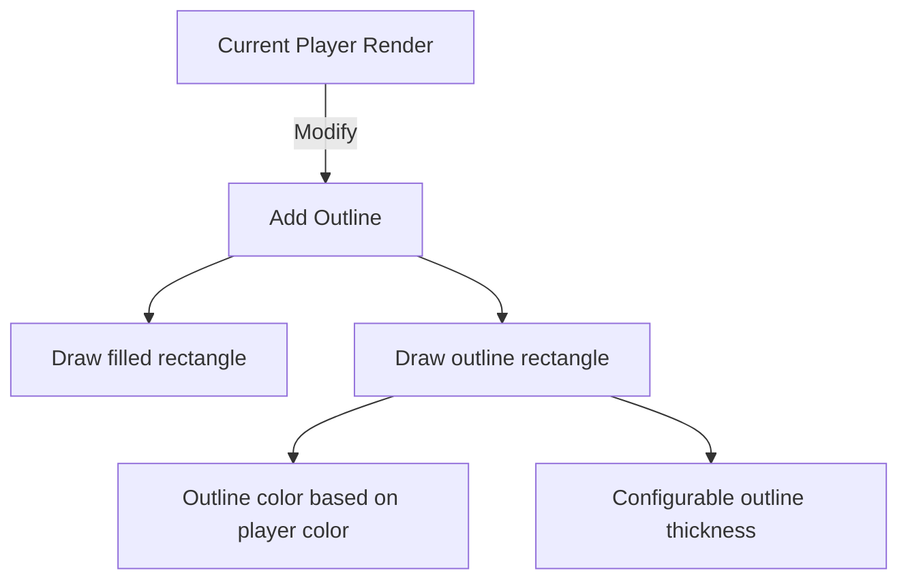
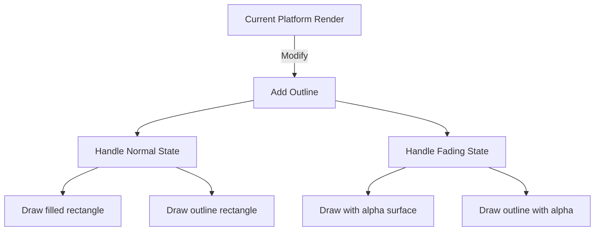
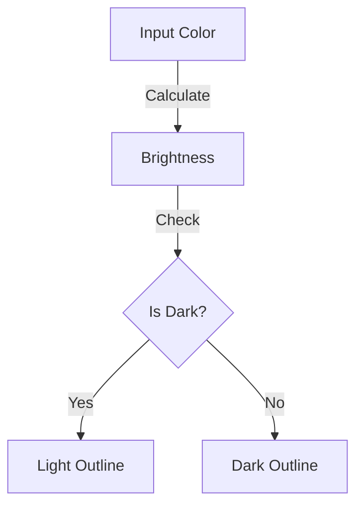

# Outline Enhancement Plan

## Overview
Add outlines to player and platform sprites to improve visibility against similar background colors.

## Implementation Plan

### 1. Player Outline Implementation


Changes needed in `player.py`:
- Add outline_thickness parameter (default: 2)
- Add outline_color calculation (will be a contrasting color to player.color)
- Modify render_at method to draw both fill and outline

### 2. Platform Outline Implementation


Changes needed in `platform.py`:
- Add outline_thickness parameter (default: 2)
- Add outline_color calculation for each platform type
- Modify render_at method to handle outlines in both normal and fading states

### 3. Color Contrast Algorithm


Implementation approach:
1. Calculate relative luminance of the fill color
2. Choose white outline for dark colors
3. Choose black outline for light colors

## Technical Specifications

### Player Class Changes
```python
def render_at(self, screen, x, y):
    # Inner fill
    draw_rect = pygame.Rect(int(x), int(y), self.width, self.height)
    pygame.draw.rect(screen, self.color, draw_rect)
    # Outer outline
    pygame.draw.rect(screen, outline_color, draw_rect, outline_thickness)
```

### Platform Class Changes
```python
def render_at(self, screen, x, y):
    if self.disappear_timer:
        # Handle fading with outline
        surface = self._create_alpha_surface()
        # Draw fill and outline on alpha surface
    else:
        # Draw normal platform with outline
